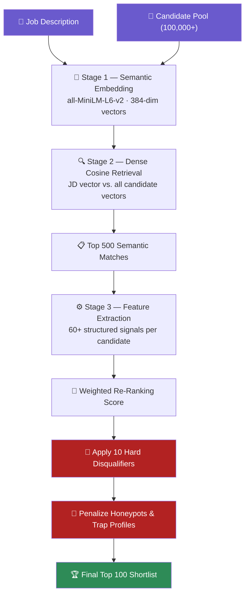
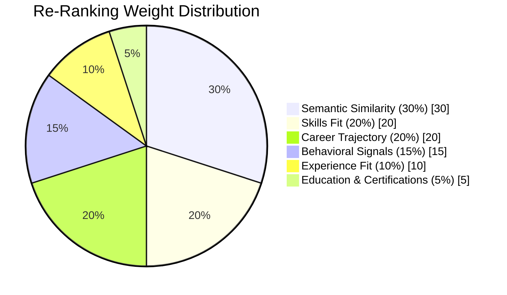

<div align="center">

# 🧠 Redrob AI — Neural Candidate Ranker

### A 3-Stage Semantic Retrieval & Re-Ranking Engine for Large-Scale Candidate Screening

[](https://www.python.org/)
[](https://streamlit.io/)
[](https://www.sbert.net/)
[](#-license)

**[🚀 Launch the Live App](#-live-demo)** &nbsp;•&nbsp; **[📖 How It Works](#️-how-the-model-works)** 

</div>

---

## 🚀 Live Demo


### ➡️(Streamlit)


### *This app may go to sleep due to inactivity.*

> ⚠️ **Important Notice:**  
> This application is hosted on a free tier. If you're the first visitor after a period of inactivity, please allow **30–60 seconds** for the service to wake up. Once active, the application will respond quickly for all subsequent users.

➡️ **[🔗 Launch Application](https://candidateranker.streamlit.app/)**  
*(⚠️ Please allow 30–60 seconds for the service to wake up)*

---

## 📌 Overview

The **Redrob AI Neural Candidate Ranker** is an intelligent candidate-screening system built to solve a real hiring problem: how do you fairly and accurately shortlist the best 100 candidates out of a pool of **100,000+**, without falling for keyword-stuffed resumes, exaggerated titles, or "honeypot" trap profiles?

Instead of brittle keyword filters, this project treats candidate ranking as a **Dense Retrieval + Multi-Signal Re-Ranking** problem — the same class of technique used in modern search and recommendation systems — combining a neural sentence-embedding model with a transparent, rule-based scoring layer.

| | |
|---|---|
| 🎯 **Goal** | Rank 100K+ candidates against a job description in under 5 minutes, CPU-only |
| 🧠 **Core Model** | `all-MiniLM-L6-v2` (Sentence-Transformers, 22M params, 384-dim embeddings) |
| 🧩 **Pipeline** | 3-stage: Embed → Retrieve → Re-rank |
| 🛡️ **Robustness** | Detects honeypots, trap profiles, and skill-stuffing via 10 hard disqualifiers |
| 🖥️ **Interfaces** | Streamlit web app **and** a scriptable CLI |
| 📤 **Output** | Ranked CSV / color-coded XLSX report with human-readable reasoning per candidate |

---

## 🗂️ Table of Contents

- [Live Demo](#-live-demo)
- [Overview](#-overview)
- [How the Model Works](#️-how-the-model-works)
- [Scoring Breakdown](#-scoring-breakdown)
- [Hard Disqualifiers & Honeypot Detection](#-hard-disqualifiers--honeypot-detection)
- [Project Structure](#-project-structure)
- [Tech Stack](#️-tech-stack)
- [Deployment Guide](#️-deployment-guide)
- [Performance](#-performance)
- [Roadmap](#-roadmap)
- [Contributing](#-contributing)
- [License](#-license)

---

## 🛠️ How the Model Works

Rather than counting keyword frequency (a strategy that favors spam and keyword-stuffed profiles), the ranker performs **semantic understanding** of every candidate profile and re-ranks the shortlist using structured, explainable signals.



### Stage 1 — Dense Semantic Representation

The neural core of the system is **`all-MiniLM-L6-v2`**, a distilled BERT-family sentence-transformer with **~22M parameters**. It converts free-text fields — headlines, career summaries, skills, education history — into dense **384-dimensional vectors** that encode *meaning*, not just word overlap. This is what allows the model to recognize that "Built recommendation systems using embeddings" and "Worked on retrieval-based ranking models" describe the same underlying skillset, even with zero shared keywords.

### Stage 2 — Dense Cosine Retrieval

The job description is embedded into the same 384-dimensional vector space, and a single batched **cosine-similarity** operation compares it against every candidate vector. This narrows a 100,000-candidate pool down to the **top 500 semantically closest matches in under a second** — the same technique that powers modern vector-database search.

### Stage 3 — Feature Extraction & Neural Re-Ranking

Each of the 500 shortlisted candidates is scored with **60+ structured features**, combined into a single weighted re-rank score, then passed through a rules layer that enforces the job description's hard constraints and penalizes suspicious profiles.

---

## 📊 Scoring Breakdown

The final re-rank score is a weighted blend of five components, tuned to reflect what actually matters for the target role:



| Component | Weight | What It Measures |
|---|:---:|---|
| 🧠 **Semantic Similarity** | 30% | Cosine similarity between candidate embedding and JD embedding |
| 🛠️ **Skills Fit** | 20% | Required/preferred skill coverage, proficiency depth, assessment scores |
| 📈 **Career Trajectory** | 20% | Role-title relevance, product vs. consulting experience, tenure stability |
| 🤝 **Behavioral Signals** | 15% | Platform activity, recruiter response rate, notice period, GitHub activity |
| ⏱️ **Experience Fit** | 10% | Closeness of total experience to the target range |
| 🎓 **Education** | 5% | University tier, field relevance, cloud/ML certifications |

---

## 🚫 Hard Disqualifiers & Honeypot Detection

To keep the shortlist trustworthy, the pipeline applies strict multipliers (`0.0`–`1.0`) that filter out profiles which pattern-match to spam, trap data, or genuine mismatches — **before** they can rank into the top 100:

- **Consulting-only trap** — candidates with only service-company experience (e.g. TCS, Wipro, Infosys) and zero product-company exposure
- **Domain mismatch** — profiles centered on unrelated specializations (e.g. CV/speech/robotics) with no relevant NLP/IR skill evidence
- **Title-chaser pattern** — 4+ roles averaging under 1.5 years each
- **Skill stuffing / honeypots** — claiming expert-level skills with zero years of usage, or tenures that predate the company's founding
- **Experience out of range** — under 2 years or over 15 years against the target band
- **Location & availability mismatches** — not based in the required region without relocation willingness, inactive 6+ months, or notice periods exceeding 120 days

Every disqualified or penalized candidate receives a **human-readable reasoning string**, so the "why" behind every ranking decision stays transparent and auditable.

---

## 📦 Project Structure

```
candidate_ranker/
│
├── app.py                    # Streamlit interactive web application
├── rank.py                   # Command-line ranking script
├── precompute.py             # Pre-encodes the candidate pool → .npy embeddings
├── ranking_engine.py         # Orchestrates the full 3-stage pipeline
├── config.py                 # Scoring weights, disqualifier rules, JD definition
├── candidate_loader.py       # Streaming JSON / JSONL candidate loader
├── job_parser.py             # Job description parsing utilities
├── utils.py                  # Text cleaning & Jaccard token-matching helpers
├── requirements.txt          # Python dependencies
├── CONTEXT.md                # Developer notes & system design context
│
└── scoring/                  # Core scoring subsystem
    ├── semantic_scorer.py      # Embedding model loader, encoder, cosine retrieval
    ├── feature_extractor.py    # Computes 60+ structured features per candidate
    ├── disqualifiers.py        # Validates candidates against hard JD rules
    └── honeypot_detector.py    # Flags trap / inconsistent profiles
```

---

## ⚙️ Tech Stack

| Layer | Technology |
|---|---|
| Language | Python 3.9+ |
| Embedding Model | [`sentence-transformers/all-MiniLM-L6-v2`](https://huggingface.co/sentence-transformers/all-MiniLM-L6-v2) |
| ML / Vector Ops | PyTorch, scikit-learn, NumPy |
| Web Interface | Streamlit |
| Visualizations | Plotly |
| Reporting | Pandas, OpenPyXL (color-coded XLSX), python-docx |
| Deployment | Streamlit Community Cloud |

---

## 🏁 Getting Started

### Prerequisites
- Python 3.9 or higher
- ~2 GB free disk space (model weights + embeddings cache)

### 1️⃣ Clone & Install

```bash
git clone https://github.com/iampiyushchouhan/candidate_ranker.git
cd candidate_ranker
pip install -r requirements.txt
```

### 2️⃣ Pre-compute Embeddings (one-time)

Downloads the MiniLM model weights and encodes your full candidate pool to `embeddings/candidate_embeddings.npy`:

```bash
python precompute.py --candidates path/to/candidates.jsonl
```

### 3️⃣ Run the Ranking CLI

```bash
python rank.py --candidates path/to/candidates.jsonl --out submission.csv --xlsx report.xlsx
```

### 4️⃣ Launch the Streamlit App

```bash
streamlit run app.py
```

Then open `http://localhost:8501` in your browser, upload a candidates file (`.json`, `.jsonl`, or `.jsonl.gz`), and view live rankings, candidate deep-dives, and downloadable reports.

---

## ☁️ Deployment Guide

### Deploy Your Own Instance on Streamlit Community Cloud

1. **Push to GitHub** — make sure `.gitignore` excludes the local `.npy` embedding cache and any large `candidates.jsonl` data files.
2. Go to **[share.streamlit.io](https://share.streamlit.io/)** and sign in with GitHub.
3. Click **New app** → select this repository → branch `main` → main file path `app.py`.
4. Click **Deploy**.
5. ⏳ On first boot, Streamlit installs `sentence-transformers` and downloads the model weights — this takes **~30–60 seconds**. The same warm-up applies whenever the app wakes from sleep after inactivity.
6. Once live, upload a candidates file and generate rankings directly in the browser — no local setup required.

---

## 📈 Performance

| Metric | Result |
|---|---|
| Candidate pool size supported | 100,000+ |
| End-to-end ranking time | < 5 minutes (CPU-only, 16 GB RAM) |
| Semantic retrieval (100K → top 500) | < 1 second |
| Hardware requirements | No GPU, no network calls, no hosted LLM APIs required |
| Honeypot tolerance | < 10% honeypot profiles in final top 100 |

---

## 🧭 Roadmap

- [ ] Hybrid retrieval (dense + BM25) for improved recall on rare skill terms
- [ ] Pluggable JD input — configure roles beyond the current hardcoded JD
- [ ] LLM-based re-ranking layer as an optional 4th stage
- [ ] Offline evaluation harness (NDCG / MRR / MAP benchmarking)
- [ ] Recruiter feedback loop for continuous re-ranking calibration

---

## 🤝 Contributing

Contributions, issues, and feature requests are welcome. If you'd like to improve the scoring logic, add new disqualifier rules, or extend the Streamlit UI:

1. Fork the repository
2. Create a feature branch (`git checkout -b feature/your-feature`)
3. Commit your changes and open a Pull Request

---

## 📄 License

This project is available under the **MIT License** — feel free to use, modify, and build on it. See the [LICENSE](LICENSE) file for details (add one if it isn't present yet).

---

<div align="center">

<h3>👤 Author</h3>

<a href="https://github.com/iampiyushchouhan">
  
</a>

<p><strong>Piyush Chouhan</strong></p>
<h3>🆘 Need Help?</h3>

<a href="https://github.com/iampiyushchouhan/candidate_ranker/issues">
  
</a>
<a href="https://www.linkedin.com/in/iampiyushchouhan/">
  
</a>

<p></p>

</div>
